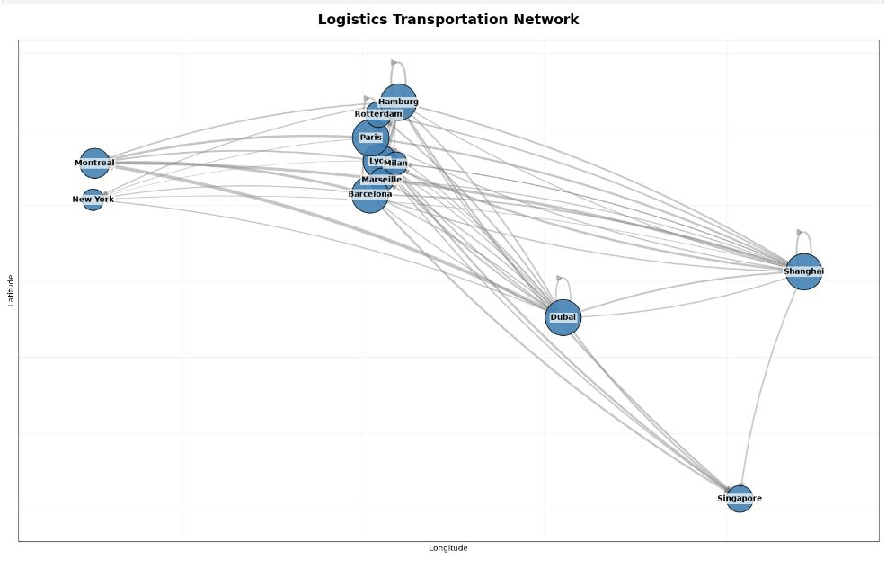
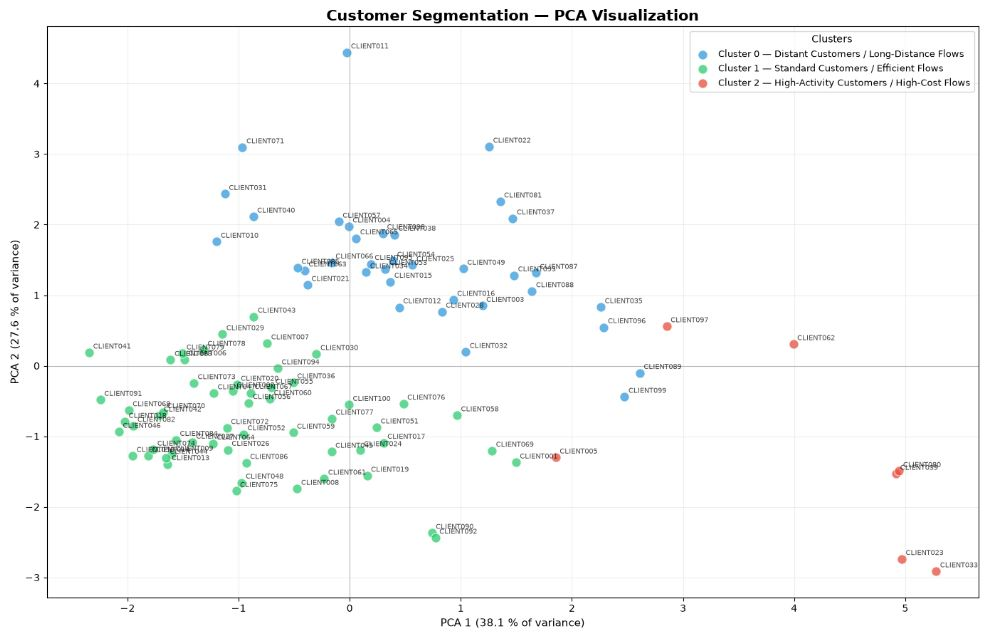
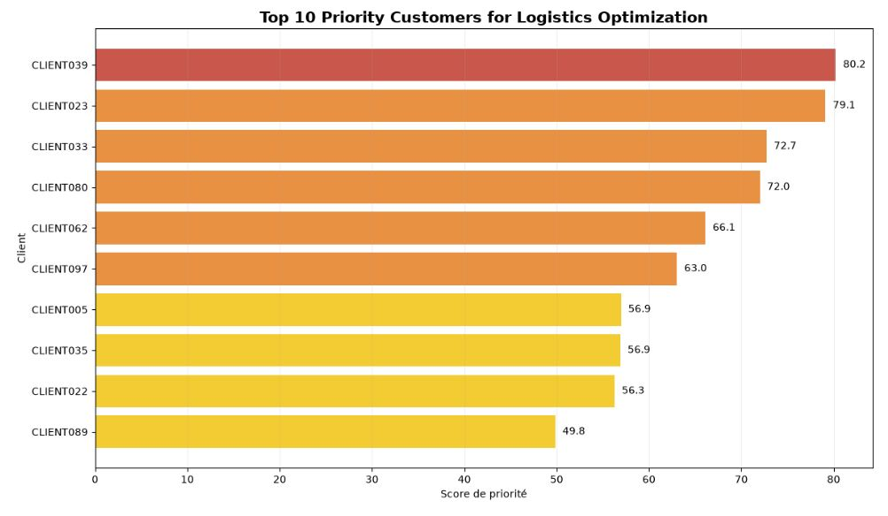

# Logistics Optimization Project

## Table of Contents

1. [Project Overview](#1-project-overview)
2. [Business Objective](#2-business-objective)
3. [Data](#3-data)
4. [Methodology](#4-methodology)

   * [4.1 PostgreSQL Data Extraction](#41-postgresql-data-extraction)
   * [4.2 Data Validation](#42-data-validation)
   * [4.3 Logistics KPI Analysis](#43-logistics-kpi-analysis)
   * [4.4 Logistics Networks Analysis](#44-logistics-networks-analysis)
   * [4.5 Customer Clustering](#45-customer-clustering)
   * [4.6 Principal Component Analysis](#46-principal-component-analysis)
   * [4.7 Customer Prioritization](#47-customer-prioritization)
   * [4.8 Recommendations](#48-recommendations)
   * [4.9 Optimization Scenario](#49-optimization-scenario)
   * [4.10 Shipment Tracking & Operational Visibility](#410-shipment-tracking--operational-visibility)
   * [4.11 Time Series Forecasting — Daily Shipment Volume](#411-time-series-forecasting--daily-shipment-volume)
5. [Key Results](#5-key-results)

   * [5.1 Global Logistics Performance](#51-global-logistics-performance)
   * [5.2 Logistics Transportation Network](#52-logistics-transportation-network)
   * [5.3 Transport Mode Analysis](#53-transport-mode-analysis)
   * [5.4 Customer Segmentation — PCA Visualization](#54-customer-segmentation--pca-visualization)
   * [5.5 PCA Analysis](#55-pca-analysis)
   * [5.6 Customer Prioritization](#56-customer-prioritization)
   * [5.7 Top 10 Priority Customers for Logistics Optimization](#57-top-10-priority-customers-for-logistics-optimization)
   * [5.8 Optimization Scenario Results](#58-optimization-scenario-results)
   * [5.9 Shipment Tracking & Operational Visibility](#59-shipment-tracking--operational-visibility)
   * [5.10 Time Series Forecasting Results](#510-time-series-forecasting-results)
6. [Business Interpretation](#6-business-interpretation)
7. [Power BI Dashboard](#7-power-bi-dashboard)
8. [Project Structure](#8-project-structure)
9. [Technologies](#9-technologies)
10. [Reproducibility](#10-reproducibility)
11. [Project Status](#11-project-status)
12. [Data Disclaimer](#12-data-disclaimer)

---

# 1. Project Overview

This project analyzes a simulated logistics network in order to identify operational inefficiencies, prioritize customers, evaluate optimization opportunities, and demonstrate how logistics data can be transformed into operational decision-support tools.

The analysis combines PostgreSQL, SQL, Python, Jupyter Notebook, network analysis, customer segmentation, PCA, optimization scenarios, operational shipment tracking, and Power BI.

The project follows an end-to-end analytical workflow, from data extraction and validation to customer prioritization, logistics optimization, and shipment-level operational visibility.

The project is structured around two complementary analytical layers:

* **Strategic and analytical optimization** — understanding the logistics network, customers, costs, emissions, and optimization opportunities;
* **Operational visibility** — providing shipment-level tracking information, current status, location, timeline, and planned arrival information.

The operational tracking component demonstrates how the analytical architecture can be extended toward a real-world logistics visibility solution.

---

# 2. Business Objective

The main objectives are to:

* validate the quality and consistency of logistics data;
* analyze transport costs, distances, CO₂ emissions, and shipment volumes;
* identify key cities and hubs in the logistics network;
* segment customers according to their logistics profiles;
* identify high-priority customers;
* provide operational recommendations;
* estimate the potential impact of selected optimization actions;
* provide shipment-level operational visibility;
* determine the current status of a shipment;
* identify the current shipment location;
* display the complete shipment lifecycle;
* expose planned arrival information;
* demonstrate how the solution could support a real-time logistics visibility platform.

The operational visibility component is designed to reflect the type of capabilities expected from modern logistics platforms such as **CLASQUIN Live**, where real-time visibility, enriched data, operational reliability, and digital capabilities support global supply-chain management.

---

# 3. Data

The project uses simulated logistics data covering:

* customers;
* shipments;
* products;
* warehouses;
* cities;
* transport modes;
* shipment legs;
* tracking events.

The original data files are stored locally in:

`data/raw/`

Processed datasets generated during the analysis are stored locally in:

`data/processed/`

These datasets are intentionally excluded from the GitHub repository through `.gitignore`.

The dataset contains:

* **100 customers**
* **1,000 shipments**
* **12 cities**
* **72 logistics network connections**

The shipment tracking component additionally uses simulated tracking events associated with shipments and shipment legs.

The data are simulated for analytical and portfolio purposes. They should not be interpreted as actual operational data from a real company.

---

# 4. Methodology

## 4.1 PostgreSQL Data Extraction

The logistics data are stored and queried in PostgreSQL.

SQL scripts are organized by analytical purpose:

* database schema and constraints;
* data validation;
* KPI calculations;
* logistics network analysis;
* customer clustering preparation;
* shipment tracking;
* shipment tracking detail.

The SQL layer provides a reusable foundation for both analytical and operational use cases.

---

## 4.2 Data Validation

The data validation stage checks the consistency and quality of the logistics data before performing the analytical stages.

The validation includes checks on:

* missing values;
* duplicates;
* relationships between tables;
* shipment and customer consistency;
* key numerical variables.

The final analytical dataset contains 100 customers and no missing values in the main logistics variables used for prioritization:

* annual demand;
* shipment count;
* shipped weight;
* transport cost;
* average distance;
* average transit time;
* CO₂ emissions.

---

## 4.3 Logistics KPI Analysis

Key logistics performance indicators are calculated to provide an overview of the network.

The analysis includes:

* total number of clients;
* total transport cost;
* average distance;
* total CO₂ emissions;
* total shipments;
* transport cost by transport mode;
* CO₂ emissions by transport mode;
* shipment volume by segment.

The global simulated logistics KPIs are:

| KPI                      |          Result |
| ------------------------ | --------------: |
| Total shipments          |           1,000 |
| Total clients            |             100 |
| Total transported weight |    3,799,966 kg |
| Total transport cost     |   €4,094,442.94 |
| Average distance         |     6,281.43 km |
| Average transit time     |    108.13 hours |
| Total CO₂ emissions      | 3,135,454.31 kg |

---

## 4.4 Logistics Networks Analysis

The logistics network is analyzed using network centrality measures.

The analysis identifies strategic cities and important network hubs using measures such as:

* PageRank;
* degree centrality;
* betweenness centrality.

Transport flows between cities are also analyzed to identify the main logistics routes.

The simulated network contains:

* **12 cities**
* **72 connections**

The network analysis identifies several highly connected cities, including Lyon, Paris, Hamburg, Barcelona, Shanghai and Dubai.

Hamburg presents the highest betweenness centrality among the analyzed cities, suggesting an important intermediary position in the simulated network.

A shortest-path analysis is also performed to identify potentially efficient routes between cities.

---

## 4.5 Customer Clustering

Customers are segmented using clustering techniques based on their logistics characteristics.

Three customer clusters are used to identify different operational profiles.

The clusters are interpreted according to variables such as:

* transport activity;
* logistics costs;
* shipment characteristics;
* distance-related indicators;
* transit time;
* CO₂ emissions.

The resulting customer segmentation is:

| Cluster   | Number of customers | Profile                                   |
| --------- | ------------------: | ----------------------------------------- |
| Cluster 0 |                  36 | Distant Customers / Long-Distance Flows   |
| Cluster 1 |                  57 | Standard Customers / Efficient Flows      |
| Cluster 2 |                   7 | High-Activity Customers / High-Cost Flows |

---

## 4.6 Principal Component Analysis

Principal Component Analysis (PCA) is used to reduce the dimensionality of the customer dataset and visualize the main patterns in the customer profiles.

The PCA helps identify the main dimensions explaining differences between customers.

The first two principal components explain:

* **PCA1: 38.10%**
* **PCA2: 27.55%**
* **Total: 65.66%**

The PCA visualization provides an additional perspective on the customer segmentation and shows how the different customer profiles are distributed in a reduced-dimensional space.

---

## 4.7 Customer Prioritization

A priority score is calculated to identify customers that represent the greatest potential for logistics optimization.

Customers are classified into priority levels:

* Very High;
* High;
* Medium;
* Low.

The prioritization combines several logistics indicators, including customer activity, transport costs, distances, transit times and CO₂ emissions.

The analysis focuses particularly on the highest-priority customers.

---

## 4.8 Recommendations

Operational recommendations are assigned according to customer profiles and clusters.

The recommendations focus on actions such as:

* optimizing warehouse allocation;
* reducing unnecessary transport distances;
* consolidating shipments;
* improving route planning;
* maintaining the current organization when no major optimization opportunity is identified.

The recommendations are therefore linked to the characteristics of each customer cluster rather than being identical for all customers.

---

## 4.9 Optimization Scenario

A scenario-based optimization analysis is performed on the Top 10 priority customers.

The scenario estimates potential reductions in:

* transport costs;
* transport distances;
* CO₂ emissions.

These values are **scenario estimates**, not measured historical improvements.

The optimization scenario is based on the assumptions implemented in the analytical model and should therefore be interpreted as an illustrative decision-support exercise.

---

## 4.10 Shipment Tracking & Operational Visibility

A dedicated operational analytics notebook has been added to demonstrate shipment-level tracking capabilities:

`notebooks/logistics_operational_analytics.ipynb`

The tracking component uses PostgreSQL tracking events to reconstruct the operational state of a shipment.

The system determines the latest valid tracking event using the event timestamp and identifies the current shipment status.

The tracking lifecycle contains four operational stages:

1. **PICKED_UP**
2. **DEPARTED**
3. **IN_TRANSIT**
4. **ARRIVED**

Each stage can be displayed as:

* **COMPLETED** — the event has already occurred;
* **CURRENT** — the event represents the current shipment status;
* **PLANNED** — the event has not yet occurred.

The tracking system also provides:

* shipment ID;
* origin city;
* destination city;
* transport mode;
* current status;
* last update;
* current location;
* planned arrival;
* actual event dates;
* complete shipment timeline.

The current location is determined according to the operational state of the shipment.

For example:

* `PICKED_UP` and `DEPARTED` use the origin location;
* `IN_TRANSIT` uses the latest available tracking coordinates and maps them to the nearest city;
* `ARRIVED` uses the destination city.

The system is designed so that the operational tracking location remains meaningful even when a direct city match is unavailable.

The corresponding SQL implementation is provided in:

* `sql/06_shipment_tracking.sql`
* `sql/07_shipment_tracking_detail.sql`

The tracking dashboard is generated directly in Jupyter Notebook and provides a visual operational representation of the shipment status and timeline.

This component demonstrates how the analytical project can be extended from historical logistics analysis toward an operational visibility use case based on continuously enriched tracking data.

---
---

## 4.11 Time Series Forecasting — Daily Shipment Volume

A daily time-series forecasting analysis was added to estimate future shipment volume using the simulated 2025 shipment history.

The analysis uses the same PostgreSQL database (`logistic_base`) as the rest of the project and focuses on `shipment_count` as the forecasting variable.

The workflow includes:

* verification of the database date range;
* construction of a complete daily time series for 2025;
* exploratory analysis of daily shipment volume;
* weekday seasonality analysis;
* time-series decomposition;
* stationarity testing using the Augmented Dickey-Fuller (ADF) test;
* autocorrelation analysis using ACF/PACF and Ljung-Box tests;
* chronological train/test splitting;
* comparison with Naive and Seasonal Naive baselines;
* ARIMA and SARIMA candidate models;
* residual diagnostics;
* final model selection;
* 28-day forecasting for January 2026.

The original dataset covers the complete 2025 calendar year:

* **365 calendar days**
* **1,000 shipments**
* **346 days with shipments**
* **19 days without shipments**

The daily series retains all calendar days, including zero-shipment days, so that the temporal structure and weekly seasonality are represented correctly.

The analysis initially considered transport cost as a forecasting variable. However, the daily cost series was strongly influenced by irregular and extreme values and did not provide a sufficiently useful temporal signal. The analysis therefore focuses on **daily shipment volume**, which is more directly interpretable as an operational workload measure.

The weekday analysis indicates statistically significant differences between at least some days of the week. The Kruskal-Wallis test produced:

* **Statistic: 14.5608**
* **p-value: 0.023962**

This supports testing a weekly seasonal structure with a period of **7 days**.

The decomposition confirms a weekly seasonal component, although the residual component remains larger than the seasonal component. The ACF analysis also shows very weak autocorrelation at the weekly lags:

* **ACF(7): 0.0021**
* **ACF(14): 0.0312**

The Ljung-Box test on the original daily series did not identify significant overall autocorrelation at the tested lags.

The Augmented Dickey-Fuller test produced a p-value below 0.05, indicating that the raw daily shipment-volume series is stationary. Consequently, no regular differencing was required and the tested ARIMA/SARIMA models use **d = 0**.

The chronological evaluation uses:

* **337 training observations**
* **28 test observations**

The baseline comparison showed that Seasonal Naive forecasting outperformed the simple Naive model:

| Model | MAE | RMSE |
| --- | ---: | ---: |
| Seasonal Naive (7-day) | 2.4643 | 3.1225 |
| Naive | 3.3214 | 3.6596 |

Three non-seasonal ARIMA candidates and two seasonal SARIMA candidates were then evaluated. **ARIMA(0,0,1)** achieved the best test performance:

| Model | MAE | RMSE |
| --- | ---: | ---: |
| **ARIMA(0,0,1)** | **1.4039** | **1.6917** |
| ARIMA(1,0,0) | 1.4059 | 1.6930 |
| ARIMA(1,0,1) | 1.4104 | 1.6953 |
| SARIMA(1,0,0)x(1,0,0,7) | 1.9299 | 2.2891 |
| SARIMA(0,0,1)x(0,0,1,7) | 2.4324 | 2.9793 |

ARIMA(0,0,1) reduced the test-set error relative to the Seasonal Naive baseline by approximately:

* **43.03% in MAE**
* **45.82% in RMSE**

The residual diagnostics support the model from an autocorrelation perspective. Ljung-Box p-values were above 0.05 at lags 7, 14, 21 and 28, indicating no significant remaining residual autocorrelation.

The Shapiro-Wilk test, however, rejected residual normality (`p < 0.05`). Therefore, the model is retained for forecasting because of its predictive performance and residual autocorrelation diagnostics, while normality-based inference is interpreted with caution.

The final model is re-estimated using all **365 observations from 2025** and produces a **28-day forecast for 2026-01-01 to 2026-01-28**.

The resulting forecast is approximately:

* **2.74 shipments per day**
* **76.77 shipments over 28 days**

The forecast should be interpreted primarily as an estimate of the future **average shipment-volume level**, rather than as a precise prediction of the exact number of shipments on every individual day.


# 5. Key Results

## 5.1 Global Logistics Performance

The simulated logistics network contains 1,000 shipments serving 100 customers.

The total transported weight is approximately **3.8 million kg**, with total transport costs of approximately **€4.09 million**.

The average shipment distance is approximately **6,281 km**, while the average transit time is approximately **108 hours**.

Total simulated CO₂ emissions reach approximately **3.14 million kg**.

These indicators provide a baseline for identifying areas where logistics performance could potentially be improved.

---

## 5.2 Logistics Transportation Network

The logistics transportation network highlights the main connections between cities and helps identify strategic locations within the simulated network.



The network analysis identifies cities that play different strategic roles.

Lyon, Paris, Hamburg, Barcelona, Shanghai and Dubai show relatively high connectivity in the simulated network.

Hamburg presents the highest betweenness centrality, suggesting that it occupies an important intermediary position between other cities.

This makes Hamburg a potential candidate for further investigation as a consolidation or transit point within the simulated network.

The shortest-path analysis also identifies an example route:

**City 2 → City 5 → City 9**

with a total distance of approximately **10,979 km**.

This demonstrates how network analysis can be used to identify potentially efficient routes and support logistics routing decisions.

---

## 5.3 Transport Mode Analysis

The transport-mode analysis shows significant differences between modes.

Road transport represents the largest shipment volume, with **473 shipments**, followed by:

* Rail: 208 shipments;
* Sea: 203 shipments;
* Air: 116 shipments.

Road transport also represents a major contributor to total transport cost because of its high shipment volume.

Air transport generates the highest total transport cost among the individual modes and also produces the highest total CO₂ emissions.

The results suggest that transport-mode selection can be an important optimization lever, particularly for long-distance flows.

However, these results are based on simulated data and do not include real-world constraints such as contractual requirements, capacity limitations, service-level agreements or actual transport availability.

---

## 5.4 Customer Segmentation — PCA Visualization

The clustering analysis identifies three customer profiles among the 100 simulated customers.

The PCA visualization provides a two-dimensional representation of the customer segments and illustrates the main differences between customer profiles.



### Cluster 0 — Distant Customers / Long-Distance Flows

* **36 customers**
* higher average distances;
* longer transit times;
* logistics flows requiring particular attention.

Recommended actions include reviewing warehouse allocation and investigating alternative routes to reduce distance, transit time and CO₂ emissions.

### Cluster 1 — Standard Customers / Efficient Flows

* **57 customers**
* relatively efficient logistics flows;
* moderate transport costs;
* represents the largest customer group.

For these customers, the recommendation is mainly to maintain the current organization and consider shipment consolidation where appropriate.

### Cluster 2 — High-Activity Customers / High-Cost Flows

* **7 customers**
* high activity levels;
* high transport costs;
* significant logistics impact.

This smaller cluster represents a particularly important optimization target.

Recommended actions include optimizing warehouse allocation, consolidating shipments and investigating lower-cost routing alternatives.

---

## 5.5 PCA Analysis

The PCA analysis provides a visual representation of the customer profiles.

The first two components explain **65.66% of the total variance**:

* PCA1: 38.10%;
* PCA2: 27.55%.

The PCA visualization shows a visible differentiation between the customer groups identified through clustering.

This provides an additional exploratory perspective on the segmentation by showing how customers with similar logistics characteristics tend to be positioned closer together in the reduced-dimensional space.

PCA is used here as a complementary analytical tool rather than as a replacement for the clustering model.

---

## 5.6 Customer Prioritization

The priority analysis identifies the customers with the greatest potential logistics impact.

The Top 10 priority customers include:

| Rank | Customer  | Segment    | Cluster | Priority Score |
| ---: | --------- | ---------- | ------: | -------------: |
|    1 | CLIENT039 | Standard   |       2 |          80.23 |
|    2 | CLIENT023 | Industrial |       2 |          79.11 |
|    3 | CLIENT033 | Industrial |       2 |          72.72 |
|    4 | CLIENT080 | Standard   |       2 |          72.00 |
|    5 | CLIENT062 | Standard   |       2 |          66.10 |
|    6 | CLIENT010 | Standard   |       2 |          63.02 |
|    7 | CLIENT005 | Standard   |       2 |          56.95 |
|    8 | CLIENT035 | Standard   |       0 |          56.89 |
|    9 | CLIENT022 | Standard   |       0 |          56.26 |
|   10 | CLIENT089 | Standard   |       0 |          49.83 |

CLIENT039 has the highest priority score at **80.23**.

The highest-priority customers are mainly associated with either:

* high activity and high logistics costs; or
* long-distance logistics flows.

This prioritization provides a practical way of focusing optimization resources on customers where the potential impact is greatest.

---

## 5.7 Top 10 Priority Customers for Logistics Optimization

The following visualization highlights the Top 10 customers identified by the priority scoring model.



The results show that the highest-ranked customers are predominantly associated with the **High-Activity / High-Cost** cluster, while some priority customers belong to the **Distant / Long-Distance Flows** cluster.

This demonstrates how the prioritization model can be used to identify customers that deserve targeted operational attention.

---

## 5.8 Optimization Scenario Results

The optimization scenario focuses on the Top 10 priority customers.

The simulated scenario produces the following results:

| KPI            |         Current |       Optimized | Estimated Improvement |
| -------------- | --------------: | --------------: | --------------------: |
| Transport cost |   €1,756,188.56 |   €1,593,925.71 |           €162,262.85 |
| CO₂ emissions  | 1,342,454.08 kg | 1,230,808.27 kg |         111,645.81 kg |

This corresponds to an estimated reduction of approximately:

* **9.2% in transport costs**
* **8.3% in CO₂ emissions**

The scenario illustrates how customer prioritization can be combined with logistics optimization assumptions to estimate potential business impact.

The largest opportunities are concentrated among the highest-priority customers, particularly those belonging to the **High-Activity / High-Cost** cluster.

> These savings are simulated estimates generated by the analytical model. They are not guaranteed real-world savings and should not be interpreted as historical performance improvements.

---

## 5.9 Shipment Tracking & Operational Visibility

The project includes a dedicated shipment-level tracking demonstration designed to illustrate how logistics analytics can be extended toward operational visibility.

The tracking dashboard is generated through:

`notebooks/logistics_operational_analytics.ipynb`

The dashboard displays:

* shipment identification;
* origin and destination;
* transport mode;
* current status;
* last update;
* current location;
* planned arrival;
* complete four-stage shipment timeline.

The operational timeline contains:

**PICKED_UP → DEPARTED → IN_TRANSIT → ARRIVED**

Each event is associated with its actual date when available.

The system distinguishes between completed, current and planned events, allowing the complete shipment lifecycle to remain visible even when only part of the journey has already been completed.

The tracking solution also propagates the planned arrival information across the operational timeline when applicable, making the expected destination date visible throughout the shipment journey rather than only on the final `ARRIVED` stage.

The resulting dashboard provides a simple operational interface for shipment visibility.


The SQL implementation is available in:

* `sql/06_shipment_tracking.sql`
* `sql/07_shipment_tracking_detail.sql`

The current implementation uses the project's simulated historical shipment and tracking data. Its purpose is to demonstrate the architecture, logic and operational user experience required for a shipment tracking solution that could subsequently be connected to current real-world data sources.

---
---

## 5.10 Time Series Forecasting Results

The time-series analysis provides a short-term forecast of daily shipment volume based on the 2025 shipment history.

The selected model is **ARIMA(0,0,1)**, which achieved the lowest test-set error among the evaluated ARIMA, SARIMA and baseline models:

* **MAE: 1.4039 shipments**
* **RMSE: 1.6917 shipments**

Compared with the Seasonal Naive baseline, the selected model reduced:

* **MAE by 43.03%**
* **RMSE by 45.82%**

The residual diagnostics indicate no significant remaining autocorrelation, although the residuals do not follow a normal distribution.

After retraining on the complete 2025 history, the model forecasts:

* **2.74 shipments per day**
* **approximately 76.77 shipments over the 28-day forecast horizon**
* forecast period: **2026-01-01 to 2026-01-28**

.png)

### Forecast Interpretation & Business Implications

ARIMA(0,0,1) forecasts an average of **2.74 shipments per day**, corresponding to approximately **76.77 shipments over the 28-day horizon**. The **95% confidence interval** indicates substantial uncertainty, with an average daily range of approximately **0.00 to 5.98 shipments**.

The forecast should therefore be interpreted as an estimate of the **overall future shipment-volume level** rather than a precise day-by-day prediction. From a business perspective, the result can support short-term capacity and workload planning, while the confidence interval highlights the need to retain operational flexibility around the expected average volume.


# 6. Business Interpretation

Overall, the analysis demonstrates how several analytical techniques can be combined to move from descriptive reporting toward data-driven logistics decision support and operational visibility.

The analytical workflow can be summarized as:

**Raw Data → SQL Analysis → Data Validation → KPI Analysis → Logistics Network Analysis → Customer Segmentation → PCA → Customer Prioritization → Recommendations → Optimization Scenario → Shipment Tracking & Operational Visibility → Time Series Forecasting**

The main business opportunities identified in the simulated dataset are:

1. identifying high-cost and high-impact customers;
2. optimizing warehouse/customer allocation;
3. investigating long-distance logistics flows;
4. improving route selection;
5. evaluating transport-mode choices;
6. consolidating shipments where appropriate;
7. reducing transport costs;
8. reducing CO₂ emissions;
9. improving shipment-level operational visibility;
10. providing a foundation for future real-time logistics tracking;
11. forecasting short-term shipment volume to support capacity and workload planning.

The analysis demonstrates that optimization should not necessarily be applied uniformly across the entire customer base.

Instead, different customer profiles require different actions:

* **Distant customers** require attention to warehouse allocation and route efficiency;
* **Standard customers** can generally be managed through operational efficiency and shipment consolidation;
* **High-Activity / High-Cost customers** should receive priority for targeted optimization initiatives.

The shipment tracking component adds an operational dimension to the project.

While the earlier analytical stages focus on historical logistics performance and optimization, the tracking component demonstrates how enriched shipment events can be transformed into actionable operational visibility.

This type of capability is aligned with modern supply-chain platforms that combine:

* global network reach;
* local operational expertise;
* enriched data;
* real-time visibility;
* reliable tracking;
* advanced analytics;
* digital decision support.

The combination of strategic analytics and operational visibility provides a broader demonstration of how logistics data can support both **optimization decisions** and **day-to-day shipment monitoring**.

Because the dataset is simulated, these conclusions demonstrate the analytical and technical approach rather than describing the performance of a real logistics operation.

---

# 7. Power BI Dashboard

The results are presented through a Power BI dashboard containing three main views.

## 7.1 Overview

The Overview presents the main logistics KPIs and a high-level view of:

* transport costs;
* CO₂ emissions;
* shipment volumes;
* customer activity;
* transport modes.

The corresponding dashboard export is available in:

`exports/powerbi/01_overview.PNG`

---

## 7.2 Clients & Recommendations

This view focuses on:

* Top priority customers;
* customer clusters;
* customer profiles;
* priority levels;
* customer recommendations.

The corresponding dashboard export is available in:

`exports/powerbi/02_clients_recommendations.PNG`

---

## 7.3 Logistics Networks

This view presents:

* strategic cities;
* network centrality;
* major transport flows;
* logistics network structure;
* estimated optimization impact.

The corresponding dashboard export is available in:

`exports/powerbi/03_logistic_networks.PNG`

The Power BI page is intentionally named **Logistics Networks** to remain consistent with the dashboard.

---

# 8. Project Structure

```text
logistic_project/
│
├── data/
│   ├── raw/                  # Local source data
│   └── processed/            # Generated datasets
│
├── exports/
│   ├── charts/
│   │   ├── 01_logistics_transportation_network.png
│   │   ├── 02_customer_segmentation_pca.png
│   │   └── 03_top10_priority_customers.png
│   │
│   │   └── 04_Daily Shipment Volume Forecast - ARIMA(0,0,1).png
│   │
│   ├── powerbi/
│   │   ├── 01_overview.PNG
│   │   ├── 02_clients_recommendations.PNG
│   │   └── 03_logistic_networks.PNG
│   │
│   └── tracking/
│       └── 01_shipment_tracking.png
│
├── notebooks/
│   ├── logistic_analysis.ipynb
│   ├── logistics_operational_analytics.ipynb
│   └── Logistics Analytics — End-to-End Operational Analysis.ipynb
│
├── sql/
│   ├── 01_schema.sql
│   ├── 02_validation.sql
│   ├── 03_kpi.sql
│   ├── 04_network.sql
│   ├── 05_client_clustering.sql
│   ├── 06_shipment_tracking.sql
│   └── 07_shipment_tracking_detail.sql
│
├── .gitignore
└── README.md
```

---

# 9. Technologies

The project uses:

* **PostgreSQL** — database management and SQL analysis;
* **Python** — data analysis and modeling;
* **Jupyter Notebook** — analytical and operational workflows;
* **Pandas** — data manipulation;
* **NumPy** — numerical computation;
* **Scikit-learn** — clustering, scaling and PCA;
* **Statsmodels** — time-series analysis, ADF testing, ARIMA/SARIMA modeling and residual diagnostics;
* **NetworkX** — logistics network analysis;
* **Matplotlib** — data visualization;
* **SQLAlchemy** — PostgreSQL connectivity from Python;
* **Power BI** — dashboard and business intelligence;
* **HTML/CSS** — operational shipment tracking dashboard rendering inside Jupyter.

---

# 10. Reproducibility

The project contains three complementary Jupyter notebooks.

## 10.1 Main Analytical Notebook

The main analytical workflow is contained in:

`notebooks/logistic_analysis.ipynb`

The notebook includes:

1. PostgreSQL connection and SQL extraction;
2. data validation;
3. logistics KPI analysis;
4. network and centrality analysis;
5. customer clustering;
6. PCA;
7. customer prioritization;
8. customer recommendations;
9. optimization scenario;
10. saving of generated results.

---

## 10.2 Operational Analytics Notebook

The operational shipment visibility workflow is contained in:

`notebooks/logistics_operational_analytics.ipynb`

This notebook contains the shipment-level operational tracking demonstration, including:

1. shipment selection;
2. current shipment status;
3. shipment timeline;
4. current location;
5. planned arrival;
6. operational tracking dashboard.

The SQL scripts used by the tracking component are:

* `sql/06_shipment_tracking.sql`;
* `sql/07_shipment_tracking_detail.sql`.
---

## 10.3 Time Series Forecasting Notebook

The time-series forecasting workflow is contained in:

`notebooks/Logistics Analytics — End-to-End Operational Analysis.ipynb`

This notebook contains:

1. PostgreSQL connection verification;
2. database date-range verification;
3. daily shipment activity analysis;
4. exploratory analysis of shipment volume;
5. weekday seasonality analysis;
6. time-series decomposition;
7. stationarity and autocorrelation testing;
8. train/test evaluation;
9. Naive and Seasonal Naive baselines;
10. ARIMA and SARIMA model comparison;
11. residual diagnostics;
12. final ARIMA(0,0,1) model selection;
13. 28-day shipment-volume forecasting.

The time-series workflow uses the same PostgreSQL database (`logistic_base`) as the other analytical components of the project.


The complete analytical and operational workflows can be reproduced by executing the notebooks sequentially after configuring the PostgreSQL connection and required Python environment.

Generated datasets and original source data are excluded from version control.

---

# 11. Project Status

The analytical workflow has been completed and successfully executed in Jupyter Notebook.

The following components have been completed:

* PostgreSQL database and SQL analysis;
* data validation;
* logistics KPI analysis;
* Logistics Networks analysis;
* customer clustering;
* PCA;
* customer prioritization;
* customer recommendations;
* optimization scenario;
* Power BI dashboard;
* shipment tracking SQL queries;
* shipment-level current status detection;
* four-stage shipment timeline;
* shipment current-location logic;
* planned-arrival visibility;
* operational shipment tracking dashboard;
* daily shipment-volume time-series forecasting;
* ARIMA/SARIMA model evaluation and diagnostics;
* final 28-day shipment-volume forecast.

The project now contains both:

### Strategic Analytics

* logistics performance analysis;
* network analysis;
* customer segmentation;
* customer prioritization;
* optimization scenarios;
* Power BI reporting;
* shipment-volume forecasting.

### Operational Visibility

* shipment tracking;
* current status;
* current location;
* shipment timeline;
* planned arrival;
* operational tracking dashboard.

The shipment tracking component is currently demonstrated using the project's simulated historical shipment data.

Its purpose is to demonstrate that the tracking logic and dashboard are operational and can subsequently be transposed to current real-world shipment data sources.

The project is therefore presented as a completed end-to-end logistics analytics and operational visibility portfolio project.

---

# 12. Data Disclaimer

> **Data Disclaimer:** **All customer, shipment, logistics, cost, tracking and environmental figures used in this project are simulated. They are intended to demonstrate analytical methods, technical skills and business reasoning and do not represent real company performance.**

**The optimization results are also simulated estimates generated from the assumptions implemented in the analytical model. They should not be interpreted as guaranteed savings or as measured improvements from a real logistics operation.**

**The shipment tracking component is also demonstrated using simulated historical shipment and tracking data. It is designed to demonstrate the technical architecture, SQL logic and operational dashboard required for shipment visibility and is not connected to live operational data.**

**The time-series forecasting results are also based on simulated shipment data and should be interpreted as analytical estimates rather than guarantees of future operational volume. The ARIMA model was evaluated on a single 28-day holdout period, so its reported performance should not be interpreted as a guaranteed future accuracy rate.**

**The project is designed as a portfolio demonstration of an end-to-end logistics analytics workflow, including SQL analysis, data validation, KPI analysis, logistics network analysis, customer segmentation, PCA, customer prioritization, recommendations, scenario-based optimization, shipment tracking, operational visibility and time-series forecasting.**
